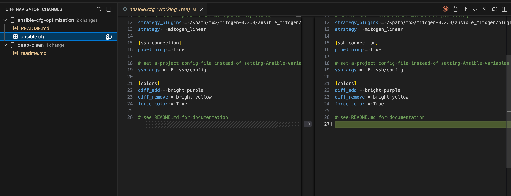

# Diff Navigator

A lightweight VSCode sidebar extension that shows changed files across all workspace git repositories. Click a file to open its diff.



## Features

- Shows all changed files grouped by repository
- Change type indicators: **M** (Modified), **A** (Added), **D** (Deleted), **R** (Renamed), **U** (Unmerged conflict)
- Click any file to open its diff view
- Terminal button on repos to open a terminal in that folder
- Reveal button on files to show them in VSCode's file explorer
- Auto-refreshes when files change

## Installation

```bash
# Install dependencies
npm install

# Compile
npm run compile

# Package (vsce ships as a devDependency)
npm run package

# Install
code --install-extension diff-navigator-1.0.1.vsix
```

## Settings

| Setting | Default | Description |
|---------|---------|-------------|
| `diffNavigator.showTerminalButton` | `true` | Show terminal button on repository folders |
| `diffNavigator.showRevealButton` | `true` | Show reveal in explorer button on files |

## Development

```bash
npm run watch    # Compile on save
# Press F5 in VSCode to launch Extension Development Host
```

### Testing

```bash
npm test         # Run unit tests (vitest)
npm run test:integration  # Run smoke tests inside a real VS Code instance
npm run lint     # Run ESLint
npm run format:check  # Check formatting
```

## Architecture

### Project Structure

```
diff-navigator/
├── package.json           # Extension manifest (defines everything)
├── tsconfig.json          # TypeScript compiler settings
├── src/                   # Source code (TypeScript)
│   ├── extension.ts       # Entry point - runs when extension activates
│   ├── changesProvider.ts # Tree view logic - what to show in sidebar
│   ├── gitUtils.ts        # Pure git status logic (unit tested)
│   ├── gitUtils.test.ts   # Vitest unit tests
│   ├── git.d.ts           # Type definitions for VSCode's git API
│   └── test/              # Integration smoke tests (run inside VS Code)
├── out/                   # Compiled JavaScript (generated)
│   ├── extension.js
│   ├── changesProvider.js
│   └── gitUtils.js
└── *.vsix                 # Packaged extension (generated)
```

### How It Works

**1. package.json - The Manifest**

This is the most important file. It tells VSCode:
- What sidebar views to create (`contributes.views`)
- What commands exist (`contributes.commands`)
- Where to show buttons (`contributes.menus`)
- What settings are available (`contributes.configuration`)
- Which file to run on startup (`main: ./out/extension.js`)

VSCode reads this file to know what the extension provides before running any code.

**2. extension.ts - Entry Point**

When VSCode loads the extension, it calls the `activate()` function here. This file:
- Creates the tree view provider
- Registers command handlers (what happens when you click buttons)
- Sets up event listeners

**3. changesProvider.ts - The Data**

This implements VSCode's `TreeDataProvider` interface, which has two main methods:
- `getChildren()` - Returns what items to show (repos at root, files under repos)
- `getTreeItem()` - Returns how to display each item (icon, label, click action)

It talks to VSCode's built-in git extension to get the list of changed files.

### Build Process

```
[TypeScript Source]  →  [tsc compiler]  →  [JavaScript]  →  [vsce]  →  [.vsix package]
     src/*.ts                                out/*.js              extension.vsix
```

**Why TypeScript?**

TypeScript is JavaScript with type annotations. VSCode extensions are written in TypeScript because:
- Better autocomplete and error checking
- The VSCode API has TypeScript definitions
- It compiles down to plain JavaScript that Node.js runs

**What each command does:**

| Command | What it does |
|---------|--------------|
| `npm install` | Downloads dependencies (TypeScript compiler, VSCode type definitions) |
| `npm run compile` | Runs `tsc` to convert `.ts` files to `.js` files in `out/` |
| `npm run watch` | Same as compile, but re-runs automatically when files change |
| `vsce package` | Bundles everything into a `.vsix` file (just a zip with metadata) |

**The .vsix file**

This is what gets installed. It's a zip containing:
- `package.json` (manifest)
- `out/*.js` (compiled code)
- `README.md`

You can rename it to `.zip` and extract it to see inside.

### Key Concepts

**TreeDataProvider**: VSCode's way of showing hierarchical data in the sidebar. You tell it what items exist and how to display them.

**Commands**: Named actions that can be triggered by buttons, menus, or keyboard shortcuts. Defined in `package.json`, implemented in TypeScript.

**Activation**: Extensions don't run until needed. Contributing a view auto-generates its activation event (VS Code 1.74+), so Diff Navigator loads the first time its sidebar view is opened instead of on every startup.

**Git Extension API**: VSCode has a built-in git extension. Other extensions can access it to get repository info, changed files, etc.
